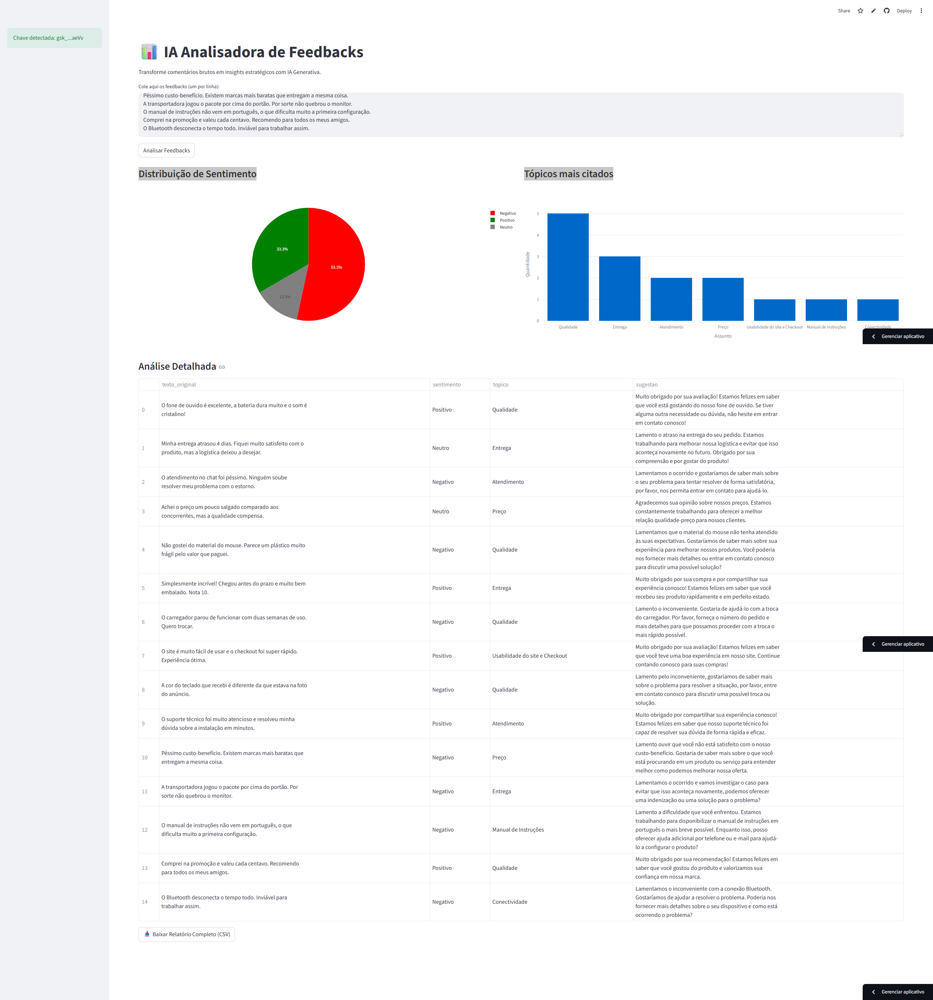

# 📊 Analisador de Feedbacks com IA Generativa

Projeto de análise de Customer Experience (CX) que utiliza Inteligência Artificial para transformar comentários brutos em insights estratégicos. A aplicação classifica sentimentos, extrai tópicos recorrentes e sugere ações de resposta em tempo real.

## 📸 Demonstração do Projeto

> **Acesse a aplicação ao vivo:** [CLIQUE AQUI PARA TESTAR O APP](https://jym8k6r53hvv5t57uvyljz.streamlit.app/))

---

## 🚀 Tecnologias Utilizadas
- **Python**: Linguagem base do projeto.
- **LangChain**: Orquestração do pipeline de LLM e parsing de dados estruturados.
- **Groq / Llama 3.3**: Modelo de linguagem de alta performance para inferência ultra-rápida.
- **Streamlit**: Framework para criação da interface web interativa.
- **Pandas & Plotly**: Processamento de dados e geração de gráficos dinâmicos.

## 💡 Funcionalidades
- **Análise de Sentimento:** Identifica se o feedback é Positivo, Negativo ou Neutro.
- **Categorização por Tópicos:** Agrupa comentários por temas como Preço, Entrega, Qualidade e Atendimento.
- **Resumo e Sugestão:** Gera um resumo de uma frase e uma sugestão de resposta para o cliente.
- **Dashboard Visual:** Gráficos interativos para visualização macro da satisfação.
- **Exportação:** Permite baixar todos os resultados analisados em formato CSV.

## 🛠️ Como rodar o projeto localmente

1. **Clone o repositório:**
   ```bash
   git clone [https://github.com/brunuCV/Analise-sentimento-ia-langchain.git](https://github.com/brunuCV/Analise-sentimento-ia-langchain.git)
   cd Analise-sentimento-ia-langchain
   
2. **Instale as dependências:

Bash
pip install -r requirements.txt

3. **Configure sua API Key:
Crie um arquivo .env na raiz do projeto e adicione sua chave da Groq:

Snippet de código
GROQ_API_KEY=gsk_sua_chave_aqui


4. **Inicie o App:

Bash
streamlit run app.py

🔑 **Configuração no Streamlit Cloud
Para rodar este projeto na nuvem, adicione sua chave nas configurações do Streamlit Cloud em Settings > Secrets:

Ini, TOML
GROQ_API_KEY = "gsk_sua_chave_aqui"
